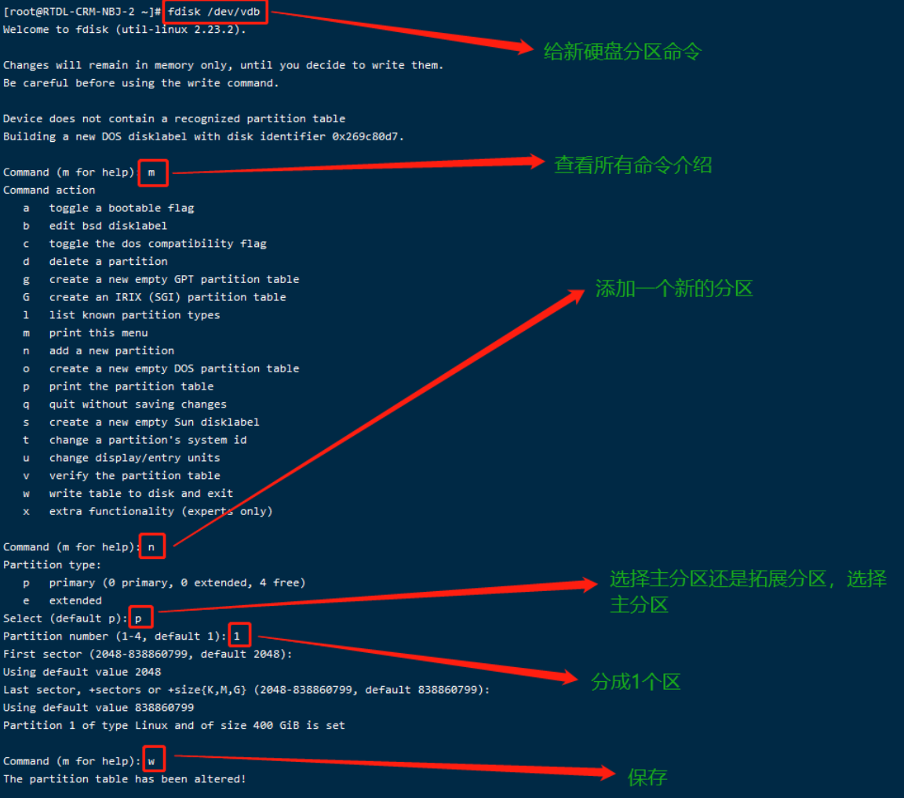
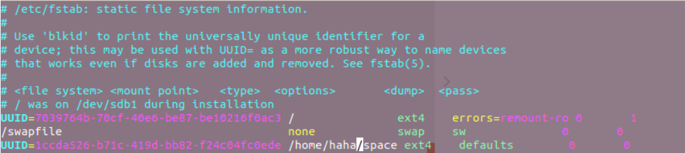

## 具体步骤

### 1、查看硬盘挂载情况

```
sudo fdisk -l    // 根据硬盘大小可以知哪块硬盘没挂载， 比如 /dev/sdb
```

### 2、查看当前分区情况

```
df -l
```

### 3、给新硬盘添加新分区

```
sudo fdisk /dev/sdb
```

按照下面步骤依次输入指令



### 4、分区完成，查询所有设备的文件系统类型

```
blkid    // 可以找到sdb的UUID
```
发现新分区并没有文件系统类型（type为文件系统具体类型，有ext3,ext4,xfs,iso9660等）

**格式化分区**

先查看当前系统支持格式化成什么类型，输入mkfs，然后按两下tab键

当前支持我们需要的ext4类型，开始格式化

```
mkfs.ext4 /dev/sdb
```

之后输入命令查看格式化后的所有文件系统类型

```
blkid    // 可以找到sdb的UUID
```

### 5、挂载

挂载需要将硬盘挂载在挂载点上（一个文件夹），需要创建挂载点（文件夹），比如挂载到 /sdb 这个目录，若没有可以 mkdir /sdb

将新分区 /dev/sdb 挂载到（挂载点） /sdb

```
mount /dev/sdb /sdb 
```

输入 mount 查看是否挂载成功。

**设置自动挂载**

磁盘被手动挂载之后都必须把挂载信息写入 /etc/fstab 这个文件中，否则下次开机启动时仍然需要重新挂载。系统开机时会主动读取 /etc/fstab 这个文件中的内容，根据文件里面的配置挂载磁盘。这样我们只需要将磁盘的挂载信息写入这个文件中我们就不需要每次开机启动之后手动进行挂载了。

首先通过 blkid 命令将分区的UUID查询出来并复制UUID（往 /etc/fstab 中追加挂载信息时建议使用UUID）

然后修改 /etc/fstab 文件，直接vim命令修改（文本之间一定要有空格），也可以用echo命令

sudo vim /etc/fstab

将下面的文本添加进去

```
/dev/device mountpoint type rules dump order
 
设备名称 挂载点 分区类型 挂载选项 dump选项 fsck选项
```

这里设备名称使用 UUID 代替。



保存修改，然后重启系统

```
sudo shutdown -r now 或者 sudo reboot
```

重启之后输入 mount 查看磁盘信息, 以及输入 df -l 查看分区情况。


## 参考

1. https://blog.csdn.net/tingzuhuitou/article/details/105492317
2. https://blog.csdn.net/bill_wjn/article/details/106013425
