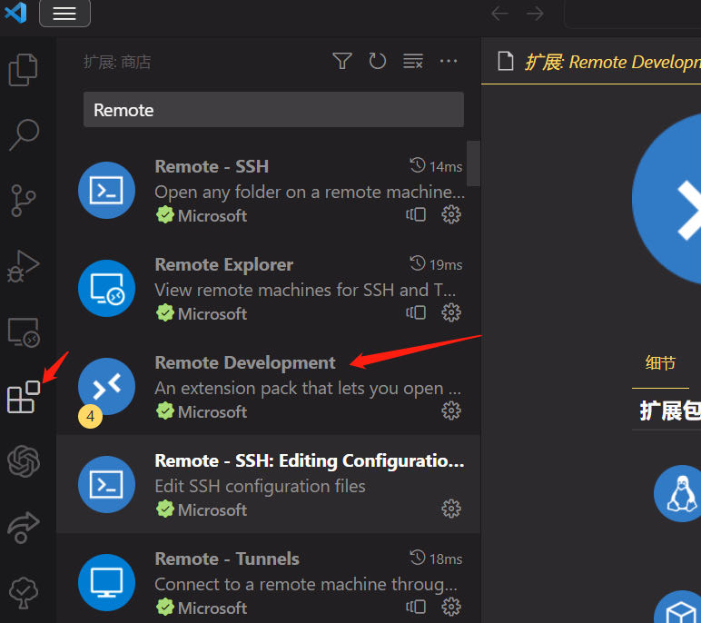
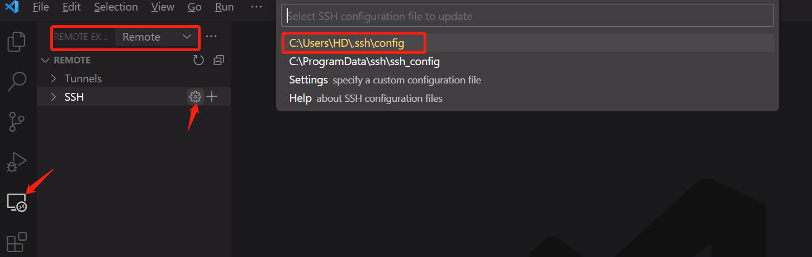
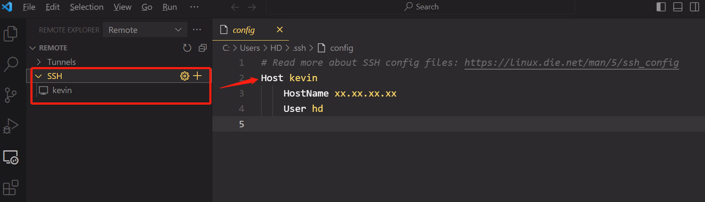
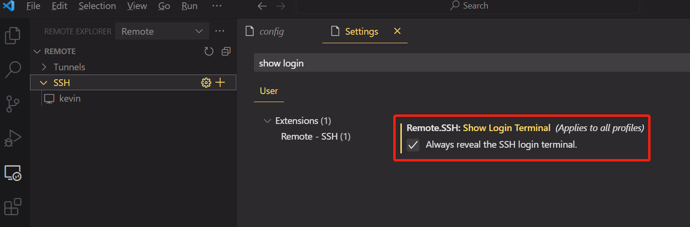
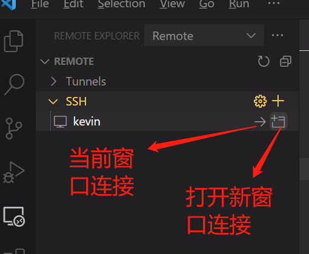
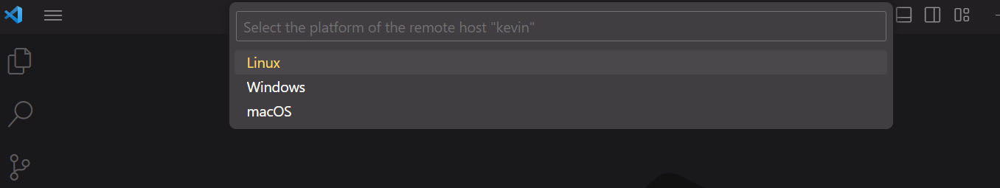
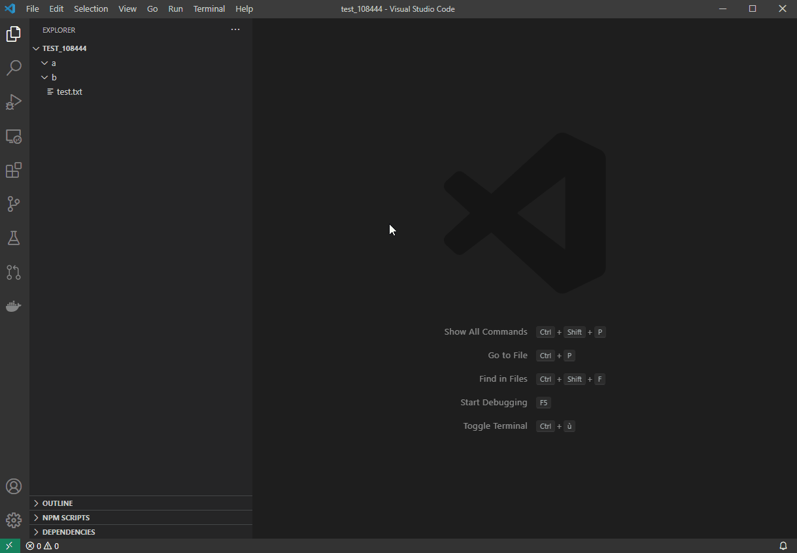

**文章目录**
- [一、准备工作](#------)
- [二、连接过程](#------)
  * [Step1：配置文件](#step1-----)
  * [Step2：连接服务器](#step2------)
  * [Step3：调试代码](#step3-----)
  * [其他问题](#----)
    + [显式设置训练参数](#--------)
    + [更改代码运行根目录](#---------)
    + [让代码在vscode关闭后也在服务器后台运行](#---------)
- [三、远程调试使用图形化界面（GUI）](#--------------gui-)
  * [Step1：下载安装 Xming](#step1-------xming)
  * [Step2：配置本地VSCode](#step2-----vscode)
  * [Step3：设置服务器环境变量](#step3----------)
  * [Step4：验证是否能够正常使用图形化界面](#step4----------------)
- [四、Git版本管理](#------)
- [参考](#--)

### 一、准备工作
测试 ssh 连接服务器。win+R 并输入 cmd，接着在命令行执行：
```
ssh -p 端口号（默认22） 用户名@服务器IP地址
```
输入密码即可连接服务器。

### 二、连接过程
#### Step1：配置文件
在 VSCode 的扩展页面搜索 Remote Development 套件并安装。



安装完后左侧菜单栏会出现一个远程资源管理的图标，选择远程中的 SSH，再点击齿轮图标，并在右侧打开你的 config 配置文件。



在配置文件中设置你的服务器信息，输入 HostName 服务器IP地址和 User 服务器用户名，保存以后左侧会出现对应机器名称。
```
Host 机器名称1，可以任意
    HostName IP地址
    Port 端口号（不加Port，则端口号默认为22）
    User 服务器登录用户名

Host 机器名称2，可以任意
    HostName IP地址
    Port 端口号（不加Port，则端口号默认为22）
    User 服务器登录用户名
	
可以设置连接多个服务器...
```



更改设置，`File->Preferences->Settings->Extension->Remote-SSH`，找到 `Show Login Terminal` 并勾选。



#### Step2：连接服务器
在上一步保存好的服务器名称旁，点击连接按钮后，选择你的服务器平台。




如果没有设置公钥私钥，那么需要在 `terminal` 输入密码才能登录成功。连接服务器后，点击右侧的加号 `+` 就能打开一个新的终端窗口，和 `XShell` 没有区别哦。

打开服务器文件，只需要在文件菜单下，点击 `Open Folder`，就能在右侧窗口查找自己想要打开的文件路径了，点击 `OK` 打开。此时对文件的编辑就可以实时同步到服务器上。

#### Step3：调试代码
安装 Python 扩展

在左下角选择调试代码需要的`conda`虚拟环境，输入路径便可搜索。

这样就可以在代码中加断点进行debug啦！

如果左下角不显示Python解释器环境也可以正常使用，`ctrl+shift+P` --> 输入 >`python` 选择 `Python: Select Interpreter` 就可以选择Python解释器环境啦。

>注意：一般无法选择conda虚拟环境、无法添加断点、Ctrl+鼠标左键无法跳转到代码模块等问题都是未安装 Python 扩展导致的，只要在 VSCode 的扩展里安装 Python 即可。

#### 其他问题
##### 显式设置训练参数
跑代码通常喜欢在命令行指定一些训练参数，比如 `python test.py --gpu 0,1 --config xxx/xx/config.yaml`命令，在代码调试时，我们希望把 `--gpu` 和 `--config` 提前设置好。

选择 `Run -> Add Configuration...` 打开 `launch.json` 文件。

在 `launch.json` 文件中添加一个字典，重点是将你需要的参数写入 `args` 列表。

这时，可以在 `Debug` 里看到我们设置好的参数环境，选择该环境。	

按 F5 就可以开始愉快的 `debug` 啦！

##### 更改代码运行根目录
如果以根目录 `root` 打开代码，那么 `debug` 时整个工程的运行根目录就是 `root`。如果想要按照 `root` 打开，但将运行根目录设置为 `root/src`，一个最简单的办法就是从 `root/src` 下打开项目，但是这样不是很方便。

这里介绍一种办法，通过修改 `launch.json` 来修改默认目录。

**step1**：首先打开 `launch.json` 文件。如果没有文件可以直接创建一个，如果已经有了可以点击右上角的齿轮符号打开 `json` 文件。

**step2**：添加下面的代码，`${workspaceFolder}` 就是打开工程的根目录，后面可以接上任意你想要指定的目录。
```json
"cwd": "${workspaceFolder}/src"
```

##### 让代码在vscode关闭后也在服务器后台运行
在终端窗口中运行你的训练代码，并在命令前加上`nohup`，命令后加上`&`，例如：
```bash
nohup python train.py &
``` 
这样就可以让训练代码在后台运行，即使关闭了VScode也不会停止。另外，可以使用如下命令来查看后台运行的进程：
```bash
ps -ef | grep python
```
或者使用如下命令来查看**输出日志**：
```bash
tail -f nohup.out
```

### 三、远程调试使用图形化界面（GUI）
#### Step1：下载安装 [Xming](http://www.straightrunning.com/XmingNotes/)
安装 Xming 自定义安装路径，其余选项默认就行，打开XLaunch，记住Display number（这里显示为0），一直点下一页直至完成。

打开Xming安装目录，打开`X0.hosts`（这个0就是上面的Display number），在localhost下面添加远程服务器的IP地址。	

#### Step2：配置本地VSCode
本地VSCode安装 `Remote-SSH` 和 `Remote X11` 插件

打开`config`，给之前添加的服务器配置加上下面三句代码：
```
ForwardX11 yes
ForwardX11Trusted yes
ForwardAgent yes
```
选择 `Run -> Add Configuration...` 打开 `launch.json` 文件，添加红框内代码。如果已经有了`env`，直接在里面添加 `DISPLAY` 就行。
```json
"env":{
	"DISPLAY": "localhost:0.0"
}
```
这里 `0.0` 就是第一步 Xming 的 Display number。	

#### Step3：设置服务器环境变量
向 `~/.bashrc` 添加环境变量，并使用 `source ~/.bashrc` 更新。
```bash
>> vi ~/.bashrc
# add environment variable to X11
export DISPLAY="localhost:0.0"
>> source ~/.bashrc
```
验证环境变量是否设置成功：
```bash
>> echo $DISPALY
localhost:0:0
```
#### Step4：验证是否能够正常使用图形化界面
验证工程程序可使用服务器GUI：可使用下面python程序，如果出现图像则安装成功。
```python
import matplotlib.pyplot as plt
import numpy as np
from mpl_toolkits.mplot3d import Axes3D

ax = plt.axes(projection='3d')
ax.scatter(np.random.rand(10),np.random.rand(10),np.random.rand(10))
plt.show()
```
验证 `terminal` 可使用 GUI：在 VSCode Terminal 中输入 `xclock`，出现时钟则安装成功。

### 四、Git版本管理


### 参考
https://blog.csdn.net/qq_31347869/article/details/121672295

https://zhuanlan.zhihu.com/p/141205262

https://blog.csdn.net/zk0272/article/details/96866513

https://github.com/microsoft/vscode/issues/108444